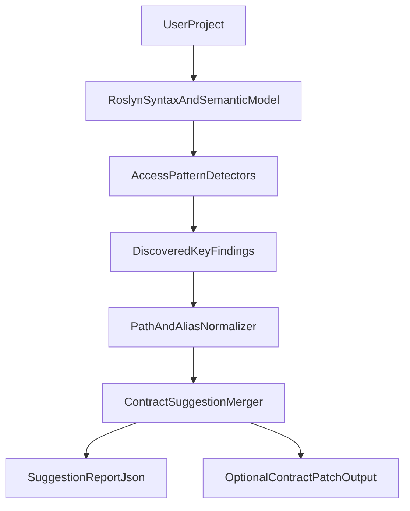

# Configuard Phase 2: Roslyn Static Discovery

This document outlines phase 2 work for configuration dependency discovery.
The objective is to reduce manual contract authoring effort without making v1 fragile.

Implementation progress and planned incremental slices are tracked in:

- `docs/configuard/phase2-implementation-notes.md`

## Phase 2 Goal

Generate contract suggestions by statically analyzing C# code that consumes configuration.

## High-Level Architecture



## Target Access Patterns (Initial)

1. `IConfiguration["A:B:C"]`
2. `configuration.GetValue<T>("A:B")`
3. `configuration.GetSection("A:B").Get<T>()`
4. `services.Configure<T>(configuration.GetSection("A:B"))`
5. `Options` classes bound via `Bind(...)` and `AddOptions<T>().Bind(...)`

These patterns provide high value with manageable false positives.

## Analyzer Components

### 1) Syntax/Semantic Extractor

- Uses `Compilation` + semantic model per document.
- Locates invocation/member access nodes matching known APIs.
- Resolves constant strings and simple interpolations.

### 2) Key Path Resolver

- Canonicalizes separators to `:`.
- Tries to resolve concatenated string constants.
- Marks unresolved dynamic expressions as `confidence: low`.

### 3) Options Binder Mapper

- Detects section paths bound to options types.
- Reflects options properties to infer candidate leaf keys.
- Emits both section-level and leaf-level suggestions with confidence flags.

### 4) Suggestion Merger

- Merges duplicate findings across projects/files.
- Adds evidence (file path + symbol) for explainability.
- Produces deterministic ordering to keep diffs clean.

## Output Contract Suggestion Shape

```json
{
  "version": "1",
  "generatedAtUtc": "2026-02-14T00:00:00Z",
  "findings": [
    {
      "path": "ConnectionStrings:Default",
      "confidence": "high",
      "evidence": [
        {
          "file": "src/Api/Program.cs",
          "symbol": "Program.ConfigureServices",
          "pattern": "Configure<T>(GetSection())"
        }
      ],
      "suggestedType": "string",
      "notes": []
    }
  ]
}
```

## CLI Additions (Phase 2)

- `configuard discover`
  - scans project/solution
  - writes findings report
- `configuard discover --apply`
  - merges high-confidence suggestions into `configuard.contract.json`
  - never removes existing keys automatically

## Confidence Model

- `high`: literal key paths and explicit options section bindings.
- `medium`: partial constant composition.
- `low`: dynamic expressions or unresolved indirection.

Default `--apply` behavior:

- auto-apply `high`
- emit `medium`/`low` as review suggestions only

## Known Risks and Mitigations

1. Dynamic key construction can cause misses.
   - Mitigation: confidence model + transparent evidence output.
2. False positives from generic helper wrappers.
   - Mitigation: allow include/exclude namespaces and custom detector plugins later.
3. Large solutions may increase analysis time.
   - Mitigation: incremental caching and project-level parallel execution.

## Rollout Plan

1. Build read-only discovery command outputting JSON report.
2. Validate on 3+ real codebases and tune heuristics.
3. Add safe merge (`--apply`) with conservative rules.
4. Promote from experimental to stable after confidence metrics are acceptable.

## Success Metrics

- Reduce manual contract key authoring by at least 50% on sample repos.
- Keep false-positive rate under 10% for `high` confidence findings.
- Keep discovery runtime under 10 seconds for medium-sized solutions.
